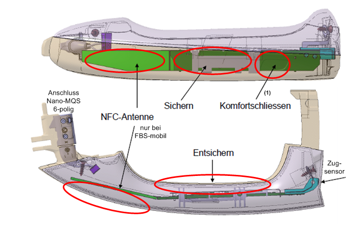
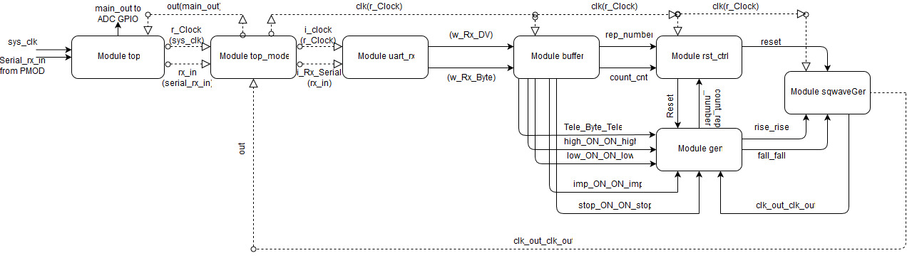
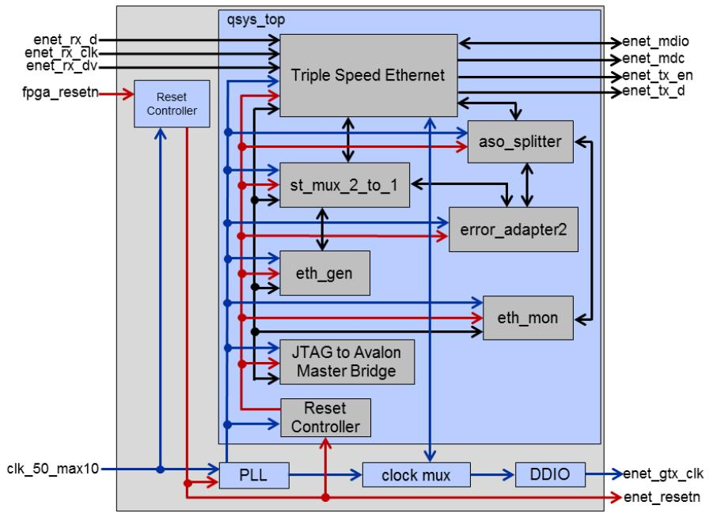
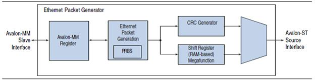
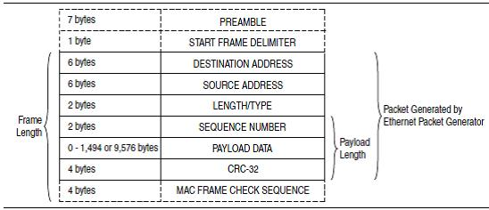
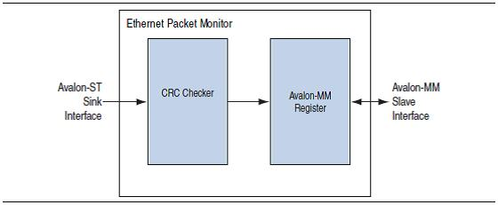
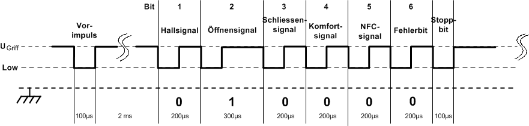
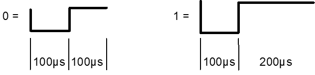

# KG HIL Door Handle Sim 

## Check out the Dissertation PDF to gain an insight into my time at India's Mercedes Benz R&D center where I was solely responsible for the cost effective development of the door handle of the company's Keyless-Go system on A HIL platform. 
## This work served to fulfill my graduation's research thesis requirement.
### Diclaimer: Copying or redistribution and use in source and binary forms, with or without modification, of the documentation or IP including but not limited to the source code pertaining to this project, for the purposes of selling or using it to develop a commercial product or for any unauthorized use is strictly prohibited and is a criminal offense. Any individual who might use this work to perform an unauthorized or immoral act, the likes of which can be justified to cause potential harm to Mercedes Benz R&D Pvt Ltd, will be in clear violation of Mercedes Benz's information theft and piracy policies, and the perpetrator will be likely to face severe legal consequences. 

Design Overview 
---------------

**Figure 7: Physical Door Handle**

**Figure 1: Verilog Module Control Flow Diagram - RS232 based**

**Figure 2: Verilog Module Control Flow Diagram - Ethernet based**

**Figure 3: Ethernet Packet Generator**

**Figure 4: Ethernet Packet Generator Output Frame Format**

**Figure 5: Ethernet Packet Monitor**

**Figure 6: Door Handle Telegram**

**Figure 8: Bit Coding-Low and High pulse values for door handle protocol**